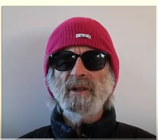
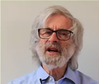
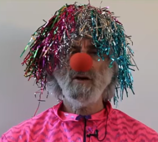
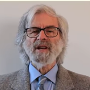
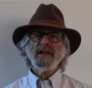

## TLA+

A tool to disign system and algorightms, then programmatically verufy that those systems [do not have critical bugs]().

- Is a language for high level (means at the design level and above the code level) modeling of digital systems.
- Has tools for checkcign those models.
- Most importatn tool:  the TLC model checker.
- It is used to model **ciritcal parts** of the digital system while apbstracting away, less critical parts and lower-level implementation detials. 
- It was designed for modelling concurrent and distributed systems. It can help you find and correct design errors including errors that are extremely difficult to detect by testing before you write a single line of code. 
- If you design  system and care about whether they work properly, you sohuld be using TLA+ or someother method for precisly specifiying and checking your designs. 

- TLA+ Toolbox:  An IDE for writing specification and running tools on them.


## Leslie Lamport

- American Computer scientist, known for his work in Distribtued system.
- Won truing award in 2013
- He was intital developer of [LaTex](https://en.wikipedia.org/wiki/LaTeX) which is a document preparing software.
- Designed [Paxos algorithm](https://en.wikipedia.org/wiki/Paxos_(computer_science)) for consensus.
- Designed [Lamport signature](https://en.wikipedia.org/wiki/Lamport_signature), one of the prototypes of the digital signature.


|                      |                      |                      |                      |                      |
| -------------------- | -------------------- | -------------------- | -------------------- | -------------------- |
|   |  |  |  |  |


## Abstraction

The process of simplification by removing irrelavant detial is called Abstraction. It perhaps the most important part of engineering. Only through absctraction one can undersatnd complex system.

> The hard part of learning to write TLA+ specs is learning to **think abstractly** about the system.

TLA+ abstraction helped a lot in coming to a much cleaner architecutre. 

Specifiying and testing above the code level is crucial for consurrent or distributed systems.

### Basic Abstraction

An execution of a sytem is represented as a **sequence** of **discrete** **steps**.

- Discrete: Discrete events. Ex. A clock is a digital system which is evolution of discrete ticks.
- Sequece: We can simulate a concurrent system with a sequential program.
- Steps: State changes. An execution is represented as state change. (with time)

## Motivation

### Amazon

> Engineers at Amazon use TLA+ to prevent serious but subtle bugs from reaching production. They have used TLA+ on 10 large complex real world systems.

In each, TLA+ has added significant value, either finding subtle bugs we would not have found by other means, or giving us enough confidence to make aggressive optimization without sacrificing correctness. Amazon has 7 teams using TLA+, with encouragement from senior management and technical leadership.

Engineers at all levels have been able to learn TLA+ from scracth and get useful results in 2 to 3 weeks. 

### Real time operation system (RTOS)


## What can you check with TLA+

We use TLA+ to ensure the systems we build "work right". 

"work right", means satisfying certain properties, the properties TLA+ can check are conditions on individual executions and see if it produced a wrong answer!
 - Does not produce a wrong answer!

A property TLA+ cant check - 99% of executions produced the right answer.


## Lets' start

High level models are called specificaiton and they come at design level, above the code level. TLA+ can specify algorithm and high level designs. You can not generate code from TLA+ spec.


## State Machines

An execution is represented as **sequence of states** (called _behaviour_).

We want to spcify all the possible behaviour of a digital system. How? 

Way of describing digital system:
- via Programming language.
- Turing machines
- Many different kind of automata
- Hardware decription languages.

But we can absctract them all with somthing called **state machines**.

A state machine can be described by two things:

1. All possible initial states. 
2. What is the next states can follow any given state.

It halts when there is not possible next state. 

How do we desrribe a state machine.?

We must descibe with 3 things:
1. Variable(s).
2. The initial value of variable.
3. The relation between their value in the current state and their possible values in the next state.

Ex.

```c
int i;
void main(){
    i = someNumber();
    i = i + 1; 
}
```

Let us assume that `someNumber()` returns a value in the set `{1-1000}`. `i` is initalized with value `0` in c.

Execution 1: say `someNumber()` returns 42

> [i: 0] -> [i: 42] -> [i: 43] 

here when current value of i = 43, there is `no next value` as the program terminates. ------- (1)

Execution 2:  say `someNumber()` returns 43

> [i: 0] -> [i: 43] -> [i: 44]

here when current value of i = 43, there is the next value is 44. ----------------------------- (2)

Here,

1. The Variable: i
2. Initial value: 0
3. Relation: ? 

From (1) and (2), you can say that IMPOSSIBLE to represent the program in this way.

- The problem is the value of `i` is only part of the program's state. 
- The other part of the state : which specify what statement is to be executed next. - that is called, **control state**. Hence we need to introduce another variable called `pc` for program control which can have three values: `start`, `middle` and `done`

1. The varaibles: i, pc
2. Inital value: i = 0, pc = start
3. relation

```
if current value of pc == start
    then next value of i in {0,1, .... 1000} 
         next vlaue of pc = middle
else if pc == middle
    then next value = i + 1 
         next value of pc = done
else no next value
```

In TLA+ this can be written in more elegant way with mathematical formula. 

- In programs  different parts of the state are represented differently. The are represented differently becasuse they are implemented differently.
- State machiens eliminates those low level implementation detials. The provide single abastraction.


> TLA+ is an elegant and extremely expressive langugage for descibing state machine. 

## Links and References

- [Video lecture on youtube](https://www.youtube.com/watch?v=p54W-XOIEF8) by [Leslie Lamport](https://en.wikipedia.org/wiki/Leslie_Lamport) who is a Turing award winner in 2013.
- [How Amazon Web Services Uses Formal Methods](https://www.cslab.pepperdine.edu/warford/math221/How-Amazon-Web-Services-Uses-Formal-Methods.pdf): Engineers use TLA+ to prevent serious but subtle bugs from reaching production.
- [Real time operating system](https://searchdatacenter.techtarget.com/definition/real-time-operating-system)


