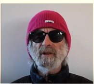
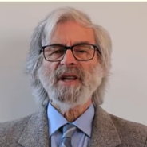
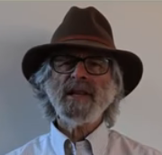

## Introduction

When we design any digital system, we need to make sure that the system is being tested properly and works on all the possible adverse condition before it is deployed on production. Sometimes, in complex systems such as concurrent and distributed systems,  it is very hard to find a few specific bugs by simple testing procedures since they are not straight forward.

[TLA+](https://lamport.azurewebsites.net/tla/tla.html) is a tool to design system and algorithms, then programmatically verify that those systems [do not have critical bugs](). It is a high-level mathematical language for modelling programs and systems-- _especially concurrent and distributed ones_.  It's based on the idea that the best way to describe things precisely is with _simple mathematics_. It can help you to find and correct design errors including errors that are extremely difficult to detect by testing before you write a single line of code. 

TLA+ comes with An IDE, **TLA+ Toolbox**, for writing specification and running tools on them. It is developed by an American Computer scientist, [Lesli Lamport](https://en.wikipedia.org/wiki/Leslie_Lamport). Leslie Lamport won truing award in 2013 for his work in the field of distributed systems. He also designed 
[Paxos algorithm](https://en.wikipedia.org/wiki/Paxos_(computer_science)) for consensus and [Lamport signature](https://en.wikipedia.org/wiki/Lamport_signature), one of the prototypes of the digital signature.


|                      |                      |                      |                      |                      |
| -------------------- | -------------------- | -------------------- | -------------------- | -------------------- |
|   |  |  |  |  |


In this blog, we are going to see a gentle introduction to TLA+. We will try to understand the concept of abstraction and state machine. We will also write first TLA+ formula (I am intentionally calling formula and not program) for a simple C toy program. 

## Motivation

> Engineers at Amazon use TLA+ to prevent serious but subtle bugs from reaching production. They have used TLA+ on 10 large complex real-world systems.

In each, TLA+ has added significant value, either finding subtle bugs we would not have found by other means or giving us enough confidence to make aggressive optimization without sacrificing correctness. Amazon has 7 teams using TLA+, with encouragement from senior management and technical leadership.

Engineers at all levels have been able to learn TLA+ from scratch and get useful results in 2 to 3 weeks. 

## Abstraction

To understand TLA+, we need to have a clear understanding of, abstraction. Abstraction is the process of simplification by removing irrelevant details. It perhaps the most important part of engineering. Only through abstraction, one can understand a complex system.

> The hard part of learning to write TLA+ specs is learning to **think abstractly** about the system.

TLA+ abstraction helped a lot in coming to a much cleaner architecture. Specifying and testing above the code level is crucial for concurrent or distributed systems.

## State Machines

An execution of a sytem is represented as a **sequence** of **discrete** **steps**. 

- Discrete: Discrete events. Ex. A clock is a digital system which is an evolution of discrete ticks.
- Sequence: We can simulate a concurrent system with a sequential program.
- Steps: State changes. An execution is represented as a state change. (with time)

The **sequence of steps** are also called _behaviour_. We want to specify all the possible behaviour of a digital system. The question is, How? 

There can be different ways of describing a digital system:

- via a Programming language.
- Turing machines
- Many different kinds of automata
- Hardware description languages.

But we can abstract them all with something called **state machines**. A state machine can be described by two things:

1. All possible initial states. 
2. What is the next states can follow any given state.

It halts when there is not possible next state. 

## Example

Let us say we have the following program in C which increment `i` with `1`. Let us also assume that the method `someNumber()` returns a number from `0` to `1000`. We also know that the initial value of `i` is `0` in C.

```c
int i;
void main(){
    i = someNumber();
    i = i + 1; 
}
```

In TLA+ specification, the state machine can be described in the following way:

1. Variables
2. Initial values of these variables
3. The relation between their value in the current state and their possible values in the next state.

So the first thing to find out is variables in our program. In the above program, it looks like we just have one variable i.e `i`. But we need one more variable. If you look at these two executions below it will be more clear why do we need another variable. 

Execution 1: say `someNumber()` returns 42

> [i: 0] -> [i: 42] -> [i: 43] 

here when the current value of `i = 43`, there is `no next value` as the program terminates. ------- (1)

Execution 2:  say `someNumber()` returns 43

> [i: 0] -> [i: 43] -> [i: 44]

here when the current value of `i = 43`, the next value is `44`. ----------------------------- (2)

From `(1)` and `(2)` we can see that variable `i` is only part of the program's state. The other part of the state, which specifies what statement is to be executed next - that is called, **control state**. Hence we need to introduce another variable called `pc` for program control which can have three values: `start`, `middle` and `done`.

So if we see now, we have two variables (`i` and `pc`). We also know their initial states (`i = 0` and `pc = "start"`). The last thing which is left is relations (the third point). 

## Describing state machine with math

In TLA+, a program can be written more elegantly with a mathematical formula. 

### Initial values

```
i  = 0  and pc = start
```
can be represented mathematically as - Replace the `and` with mathematical representation, i.e `/\`;

```
(i = 0) /\ (pc = start)
```

### Relation between their values in the current state and their possible values in the next state

The above C program can be written in this form. 

```
if current value of pc == start
    then next value of i in {0,1, .... 1000} 
         next vlaue of pc = middle
else if pc == middle
    then next value = i + 1 
         next value of pc = done
else no next value
```

Let's convert this in maths:

lets use `pc` or `i` for current values and `pc'` or `i'` for next values. And replace the word `equal` with the symbol `=`. Also, we can use AND (`/\`) symbol for concatenation of two statements.

```
IF pc = "start"
    THEN (i' \in 0...1000) /\
         (pc' = "middle")
    ELSE IF pc = "middle"
        THEN (i' = i + 1) /\
             (pc' = "done")
        ELSE FALSE
```

But remember we are not writing instruction but formula. So the above statement means, if `pc = "start"`, the formula equals `then-formula`, otherwise it equals the `else-formula`. 

Let us say we represent,

```
|----------------------|       _____
|(i' \in 0...1000) /\  |====> |     |
|(pc' = "middle")      |      |  A  |
|                      |      |_____|
|----------------------|
```
And 

```
|----------------------|       _____
|(i' = i + 1) /\       |====> |     |
|(pc' = "done")        |      |  B  |
|                      |      |_____|
|----------------------|
```

We can write,

```
IF pc = "start"
    THEN A
    ELSE IF pc = "middle"
        THEN B
        ELSE FALSE
```

Now that we have a formula for initial states and relations, we can write a complete mathematical description as two formulas for `initial-state` and `next-state`:

```
Initial-state formula: (i = 0) /\ (pc = "start")
```

```
Next state formula: IF pc = "start"
                        THEN A
                        ELSE IF pc = "middle"
                            THEN B
                            ELSE FALSE
```

There are two cases for the Next state formula:

1. (pc = "start") and A is true. i.e. `(pc = "start") /\ A` is true
2. (pc = "middle") and B is true. i.e. `(pc = "middle") /\ B` is true

We can re-write the next state formula like this:

```
Next state formula: (pc = "start") /\ A
                    OR (pc = "middle") /\ B          
```
Replacing OR with symbol `/\`

```
Next state formula: (pc = "start") /\ A
                    \/ (pc = "middle") /\ B          
```

Let's replace A and B:

```
(
        (   (pc = "start")   
        /\ (i' \in 0...1000) 
        /\ (pc' = "middle") )
    \/  (   (pc = "middle")  
        /\ (i' = i + 1)      
        /\ (pc' = "done")   )
)
```

We can also remove some of the parenthesis as they are not very helpful:

```
(
        (   pc = "start"
        /\  i' \in 0...1000
        /\  pc' = "middle" )
    \/  (   pc = "middle"  
        /\  i' = i + 1      
        /\  pc' = "done"   )
)
```

Furthermore, the inner parenthesis can be replaced with another and (`/\`) symbol.

```
(
        /\  pc = "start"
        /\  i' \in 0...1000
        /\  pc' = "middle" 
    \/  /\  pc = "middle"  
        /\  i' = i + 1      
        /\  pc' = "done"   
)
```

The outermost parenthesis can also be replaced with another OR (`/\`) symbol in TLA+ specification.

```
    \/ /\  pc = "start"
       /\  i' \in 0...1000
       /\  pc' = "middle" 
    \/ /\  pc = "middle"  
       /\  i' = i + 1      
       /\  pc' = "done"   
```

Now we can compare out TLA formula with our C code. 

```
    \/ /\  pc = "start"                     int i;
       /\  i' \in 0...1000                  void main(){
       /\  pc' = "middle"                       i = someNumber();
    \/ /\  pc = "middle"                        i = i + 1;
       /\  i' = i + 1                       }
       /\  pc' = "done"      
```

## The complete TLA+ specification

Module: SimpleProgram

```
EXTENDS Integers
VARIABLES i, pc

Init == (pc = "start") /\ (i = 0)

Next == \/ /\  pc = "start"
           /\  i' \in 0...1000
           /\  pc' = "middle" 
        \/ /\  pc = "middle"  
           /\  i' = i + 1      
           /\  pc' = "done"
```

For the real spec, the next state can be 100s of line. We can understand a big formula by splitting it into smaller parts. Math has a very simple and powerful way to do that: _using definitions_. Take a look below:


```
Pick == /\  pc = "start"
        /\  i' \in 0...1000
        /\  pc' = "middle" 

Add1 == /\  pc = "middle"  
        /\  i' = i + 1      
        /\  pc' = "done"

Next == Pick \/ Add1
```

Congratulation we have just written our first formula for TLA+. I know it is not making too much sense with this toy example as eventually it will as we learn more about TLA+  in upcoming blogs. In the next blog, we will try to simulate our first formula in TLA+ Toolbox and will learn how to run it. 

I hope this blog was informative. See you in the next blog. :)


## References

- [TLA+ video course](https://lamport.azurewebsites.net/video/videos.html)
  - [Youtube](https://www.youtube.com/watch?v=p54W-XOIEF8)
- [TLA+ google group](https://groups.google.com/g/tlaplus)
- [Few more resource](https://pron.github.io/tlaplus)
- [Discussion on YC](https://news.ycombinator.com/item?id=22496287)